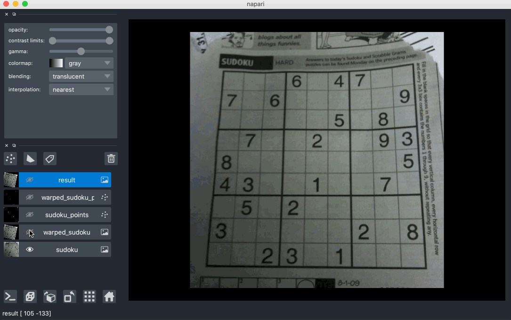

# matched-points-example

Trialling [napari PR #1616](https://github.com/napari/napari/pull/1616)

Using a [matched points example](https://github.com/DeMarcoLab/correlateim) and [scikit-image RANSAC](https://scikit-image.org/docs/dev/auto_examples/transform/plot_matching.html)
 for affine transformation.
 

